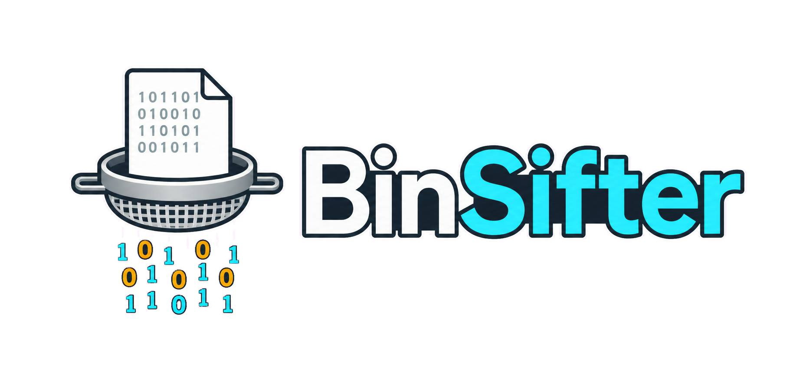
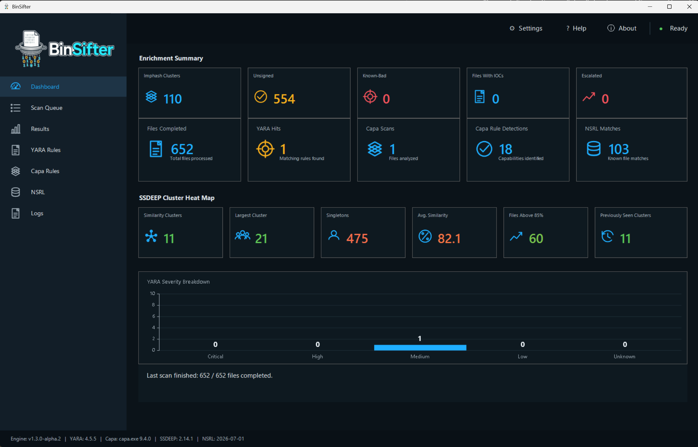
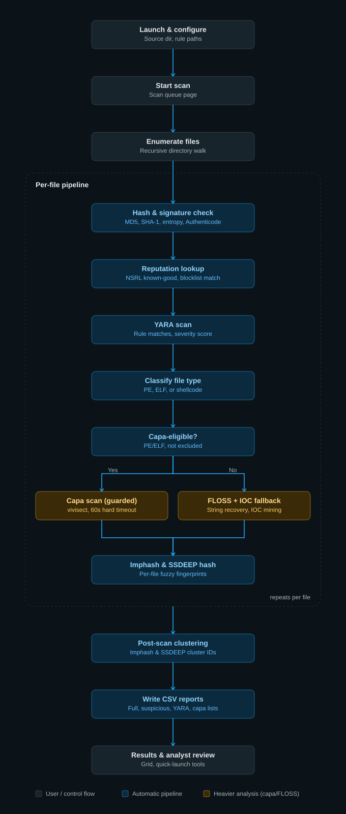

# BinSifter

BinSifter is a binary triage tool built for forensic examiners who need to make a quick go/no-go call on a pile of unknown files. Point it at a directory and it hashes everything, checks each file against YARA rules and CAPA capability detection, looks it up against an NSRL known-good set and an optional known-bad blocklist, and lays the results out in a filterable dashboard so you can triage a batch fast instead of opening files one at a time.

## Demo

## Variants

BinSifter ships as multiple independently-developed variants, each with its own codename, sharing the same detection design and pipeline logic:

| Codename | Platform | Status |
| --- | --- | --- |
| **Rowan** | PowerShell 7 + WinForms (Windows-only) | **Released.** Proven original, run against real casework, installers available (standard, MSI, portable) |
| **Winnow** | Python + PySide6 (cross-platform goal) | **Released.** Full GUI and scan engine, run against real malware samples end-to-end, installer available |
| **Ingot** | Rust | Planned, not yet started |

## Status

**Rowan has a release.** `BinSifter-Rowan.ps1` is a PowerShell 7 + WinForms desktop app, proven against real casework, and now packaged as a real release - see "Getting started" below for the four ways to install or run it.

**Winnow has a release.** It's a full rewrite in Python and PySide6 (see the `binsifter/` package), built to get BinSifter off Windows-only WinForms and onto something that can eventually run on Linux too. Both the scan engine and the GUI are real and working, not a placeholder: a full desktop app (Dashboard, Results grid, Scan Queue, Settings, Logs, YARA/capa rule management, Help, About) backed by the same detection pipeline as Rowan - hashing/entropy, NSRL, blocklist, YARA with MITRE ATT&CK enrichment, CAPA, FLOSS, Speakeasy emulation, Authenticode (embedded + catalog-based) verification, archive/compressed-file expansion (zip/tar/gzip/7z, including password-protected and AES-encrypted zips), IOC extraction, SSDEEP/imphash clustering, draft YARA rule generation, and CSV reporting. It's been run end-to-end against real malware samples across multiple machines, not just synthetic test fixtures, with every known bug from that testing found and fixed. `pip install -e .` then `python -m binsifter.gui` launches the desktop app, and `binsifter-scan --src-dir ... --yara-rules ... --nsrl-path ...` runs a full headless scan. See `BinSifter_CHANGELOG.md` for Rowan's history.

Winnow is newer than Rowan and hasn't seen as much real-casework mileage yet - please report anything that looks wrong rather than assuming it's expected.

**NSRL caching:** the first scan against a given NSRL hash set builds a cached, memory-mapped index from it - a one-time cost that scales with the NSRL file's size, not the number of files being scanned (around 30 minutes for a full ~430-million-hash NSRL RDS set, measured directly). Every scan after that against the same NSRL file and Report Directory loads the cache directly (well under a second) instead of re-parsing it, so don't be alarmed if the very first scan against a new NSRL set takes noticeably longer than every scan after it. The cache lives under `<ReportDirectory>/.bsifter-nsrl-cache/` and rebuilds automatically if the source NSRL file's size or modified date changes, so switching Report Directory or NSRL file costs one more full rebuild, not a lasting slowdown.

## Core features

- Hashing (MD5/SHA-1/SHA-256), Shannon entropy, and NSRL known-good lookup for every file in a scanned directory
- YARA rule matching with MITRE ATT&CK technique enrichment
- CAPA capability detection, with a FLOSS string-extraction fallback for files CAPA can't parse
- SSDEEP fuzzy-hash clustering and imphash exact-match clustering across a batch
- Authenticode signature verification and an optional offline known-bad hash blocklist check
- Draft YARA rule auto-generation per SSDEEP cluster
- Per-file triage disposition tracking, persisted across scans
- Results-grid quick-launch into PE Studio, DIE, CFF Explorer, Resource Hacker, Ghidra (headless), Sigcheck, x64dbg/x32dbg, and Speakeasy

## How it works

## Requirements

**Rowan:** Windows, PowerShell 7+ (`pwsh.exe`).

**Winnow:** Python 3.10+, any OS the GUI's requirements support (developed and tested on Windows so far). Install with `pip install -e .` from the repo root. On Windows, also install the [Microsoft Visual C++ Redistributable (x64)](https://learn.microsoft.com/en-us/cpp/windows/latest-supported-vc-redist) if it isn't already on the machine - the Speakeasy emulation feature's underlying engine (Unicorn) needs it to load. If it's missing, every other BinSifter feature still works normally; only Speakeasy emulation reports a clear error instead of running.

**Both variants:**

- An NSRL known-good hash set (not included - see Settings). NSRL ships as RDSv3 hashes; BinSifter's NSRL loader expects the older RDSv2 text-file format, so you'll need to convert first - see NIST's own [RDSv3 to RDSv2 text files conversion guide](https://s3.amazonaws.com/rds.nsrl.nist.gov/RDS/RDSv3_Docs/RDSv3_to_RDSv2_text_files.pdf) (PDF).
- Whichever of the optional external tools above you want quick-launch access to (not included - point BinSifter at a single tools directory in Settings and it searches it recursively). Winnow's archive/compressed-file support additionally needs `7z.exe` under that same tools directory.

## Getting started

**Rowan** - four ways to get it running, pick whichever fits:

- **Standard installer** (`BinSifter-Rowan-Setup.exe`) - the usual install/uninstall flow, Start Menu shortcut, optional desktop icon.
- **MSI** (`BinSifter-Rowan.msi`) - the same install, packaged for managed/enterprise deployment (Group Policy, SCCM, Intune) instead of a standard installer.
- **Portable** (`BinSifter-Rowan-Portable.zip`) - no install/uninstall, extract and run `BinSifter-Rowan.exe` from inside the extracted folder (the DLLs alongside it are required, don't move the exe out on its own).
- Or skip packaging entirely and launch `BinSifter-Rowan.ps1` directly with `pwsh.exe -File`.

All four need PowerShell 7 (`pwsh.exe`) already installed. See `installer/README.md` for how each package is built.

**Winnow:** `pip install -e .` from the repo root, then `python -m binsifter.gui` to launch the desktop app (or `binsifter-scan --src-dir ... --yara-rules ... --nsrl-path ...` for a headless scan). A packaged installer (`BinSifter-Winnow-Setup.exe`) is also available - see `installer/README.md`.

Full configuration details for either variant are in the in-app Help page.

## License

BinSifter is source-available, not open source. See `LICENSE` (PolyForm Strict License 1.0.0) - noncommercial use, including by forensic examiners, government, and research institutions, is permitted, but redistribution and modified or derivative versions require permission from the licensor.
